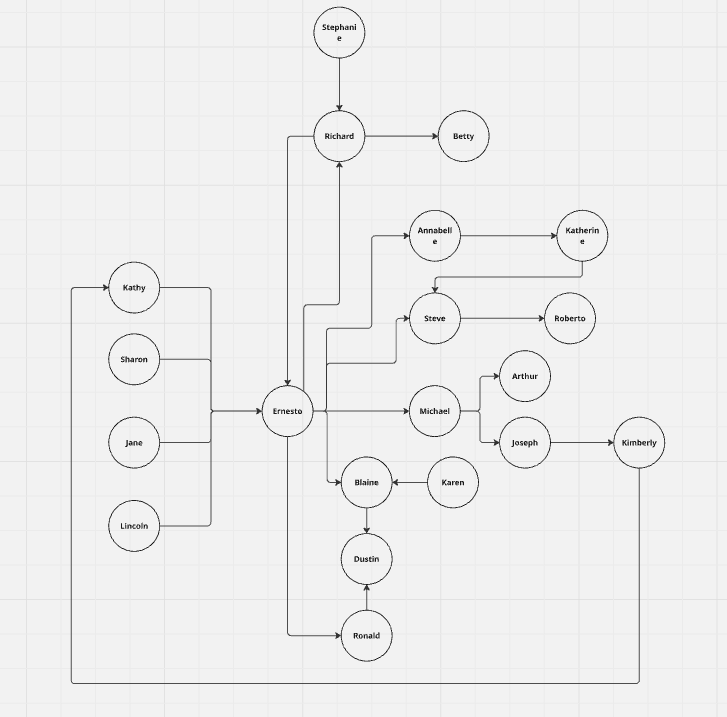

# 🍊 Orange Graph 🍊

Aplicação Spring Boot para gerenciamento de transações e contas, com suporte a MySQL e H2.

## Requisitos

- Java 21+
- Maven 3.8+
- Docker (para rodar o MySQL)
- Navegador web

## Como rodar a aplicação

### 1. Subindo o banco MySQL com Docker

```sh
docker-compose up -d
```

### 2. Configurando o banco

No arquivo src/main/resources/application.yml, descomente a seção de configuração do MySQL e comente a do H2, se desejar usar o MySQL.

### 3. Build e execução

```sh
mvn clean install
mvn spring-boot:run
```

> [!NOTE]
> <br>Para usar o H2, mantenha a configuração padrão do application.yml.
> <br>Para usar o MySQL, lembre-se de subir o container Docker e ajustar o application.yml.

### 4. Acessando a aplicação

- Swagger UI:
  - http://localhost:8080/swagger-ui.html


- H2 Console: http://localhost:8080/h2-console
  - `JDBC URL`: jdbc:h2:mem:orange_graph_db
  - `User`: sa
  - `Password`: password
 
## Testes e cobertura

Após rodar os testes com:
```sh
mvn clean install
```

Abra o relatório de cobertura Jacoco em: `target/site/jacoco/index.html`

Basta abrir esse arquivo no navegador.

## Demonstrações

### Cobertura de Testes

A cobertura de testes da aplicação é gerada automaticamente utilizando o plugin JaCoCo durante o processo de build. O relatório apresenta o percentual de código coberto por testes automatizados, permitindo acompanhar a qualidade e a robustez do projeto. Atualmente, a aplicação atinge 99% de cobertura de código.


### Exemplo de Grafo

O exemplo abaixo ilustra o grafo de transações gerado a partir dos dados presentes no arquivo data.sql. Esse grafo representa visualmente as relações entre as contas e as transações realizadas, conforme configurado no banco de dados inicial da aplicação. Dessa forma, é possível compreender como as contas estão conectadas e analisar o fluxo de transações simuladas no sistema.



<hr></hr>
